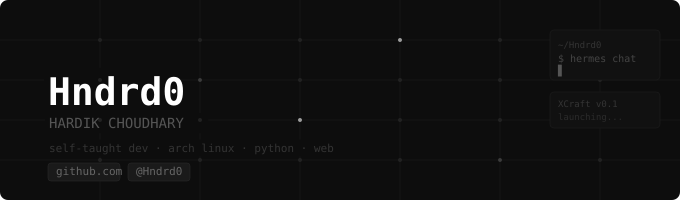

 
 

---

### 🛠️ stack

---

### 📊 GitHub Stats:
 
 

---

  
### 🛠️ Things I've Built

| Project | What it does | Stack |
|---------|---------------|-------|
| 🛡️ [**Interlude-Defender**](https://github.com/Hndrd0/Interlude-Defender) | A non-forgiving local antivirus — SHA256 hashing, PE heuristics, entropy analysis, import table inspection | `Python` `PySide6` |
| 🎨 [**interlude-OS**](https://github.com/Hndrd0/interlude-OS) | KDE Plasma riced to look like Windows, on Arch | `Shell` `KDE` |
| 📱 [**Redmi Note 7 Pro Guide**](https://github.com/Hndrd0/Redmi-Note-7-Pro-Violet) | Bootloader unlock + custom ROM guide | `Markdown` |
| 📄 [**PDF Hub**](https://github.com/Hndrd0/pdf) | CBSE Class 10 PDFs, browsable web page | `HTML` `CSS` `JS` |

*"it works on my machine"*

